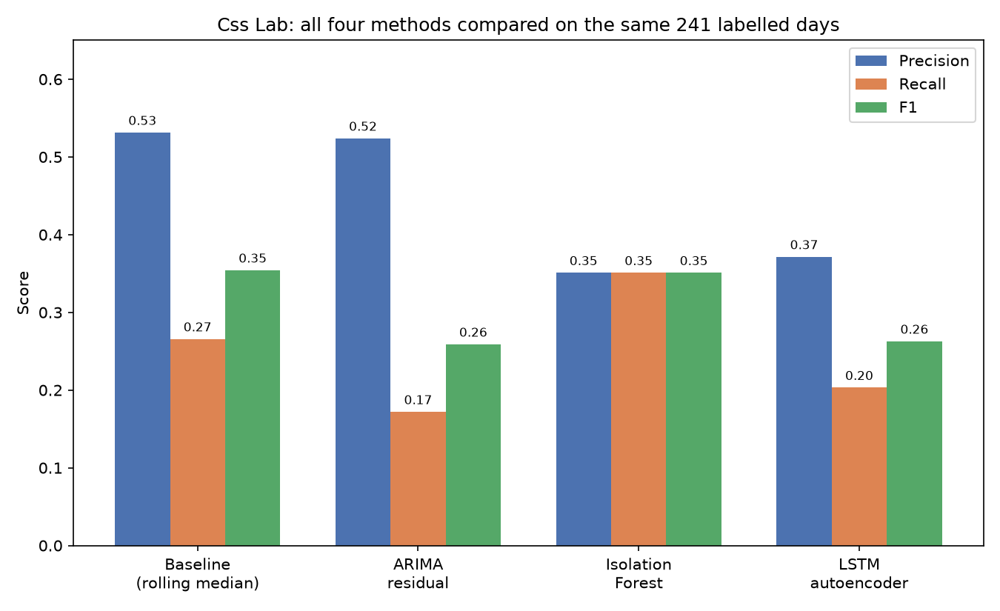
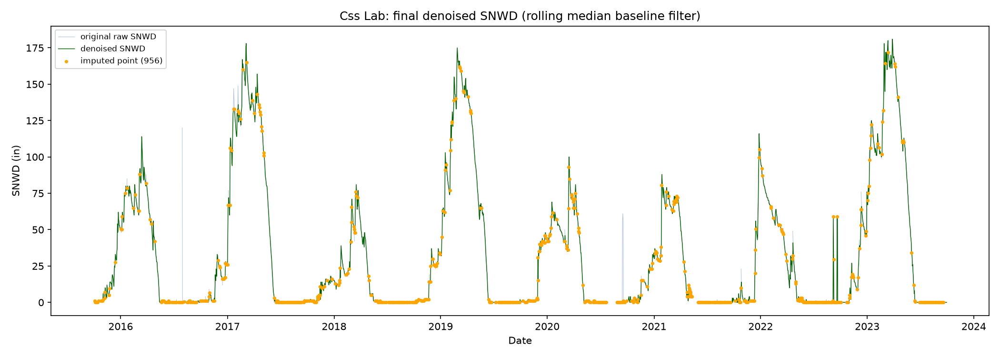

# Detecting and Correcting Sensor Noise in SNOTEL Snow Depth Records

**A comparison of statistical and machine learning approaches**

MSc Applied Data Science dissertation, Royal Holloway, University of London (2026). Full write-up: [Dissertation.pdf](Dissertation.pdf)

## Overview

Automated snow depth sensors in the USDA's SNOTEL network are used for water resource planning and avalanche forecasting, but their raw readings contain faults such as false echoes (isolated readings of over 360 inches) and stuck values.

This project asks: **can a machine learning model tell a real snow event from a sensor fault more reliably than a simple statistical rule?**

Using eight years (2,922 days) of raw data from one station, I manually labelled 241 days as ground truth and compared a rolling-median (Hampel) baseline against ARIMA, Isolation Forest and LSTM autoencoder detectors, then used the best method to produce a cleaned dataset.

## Results

Evaluated on the 241 labelled days (noise = positive class):

| Method | Precision | Recall | F1 |
|---|---|---|---|
| Rolling median baseline (Hampel) | 0.53 | 0.27 | 0.35 |
| ARIMA-residual | 0.52 | 0.17 | 0.26 |
| Isolation Forest | 0.35 | 0.35 | 0.35 |
| LSTM autoencoder | 0.37 | 0.20 | 0.26 |

The Isolation Forest could only score 57 of the 64 noise days, so its figures are based on those.



- **No machine learning method significantly beat the simple baseline.** The Isolation Forest matched its F1, but a paired McNemar test showed the baseline was correct more often where they disagreed (23 days vs 7, p = 0.005).
- **Details mattered.** Fixing a zero-spread edge case in the Hampel filter raised its recall from 0.05 to 0.27.
- **More data didn't help.** Pooling unlabelled data from five other stations made both ML models worse, likely because stations have different noise profiles.
- **Cleaned dataset:** `snotel_denoised.csv` resolves 956 problem days (32.7% of the record), with every imputed value flagged.



Per-method plots showing exactly which days each detector caught, missed or wrongly flagged are in `figures/` ([baseline](figures/baseline_filter_evaluation.png), [ARIMA](figures/arima_model_evaluation.png), [Isolation Forest](figures/isolation_forest_evaluation.png), [LSTM](figures/lstm_autoencoder_evaluation.png)), along with the [epoch sweep](figures/epoch_sweep.png) and [station pooling](figures/station_pooling_effect.png) results.

## Run it yourself

Python 3.11 or later is recommended.

```bash
git clone https://github.com/IllyaHanslip/snotel-sensor-detection.git
cd <repo-name>
pip install -r requirements.txt

python data_preprocess.py          # download and clean the raw data (needs internet)
python baseline_filter.py          # evaluate each method
python arima_model.py
python isolation_forest_model.py
python lstm_autoencoder_model.py
python feature_ablation.py         # optional: feature study
python denoise_dataset.py          # run last: produces the final dataset
```

Each script prints its results and saves a results CSV. The preprocessed data (`snotel_preprocessed.csv`) and my hand labels (`manual_labels.csv`) are included, so `label_data.py` doesn't need rerunning. The `*_plot.py` scripts regenerate the figures; the epoch sweep and pooling ones retrain models and are slow.

## Data

USDA NRCS SNOTEL network via the public AWDB REST API: station Css Lab (428:CA:SNTL), California, 1 October 2015 to 30 September 2023. The pipeline retrieves the raw, uncorrected readings, and NRCS's own edited values are never used as ground truth.

## Limitations

- Ground truth is 241 days from a single station, so the statistical comparison has limited power.
- Methods are evaluated on the same series they are fitted to, which suits cleaning a fixed record but not live monitoring.
- The Hampel baseline is univariate, so it misses subtler faults found by cross-checking water equivalent.

- 
